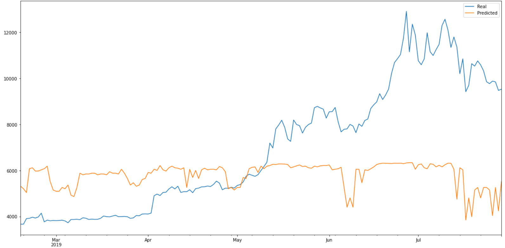
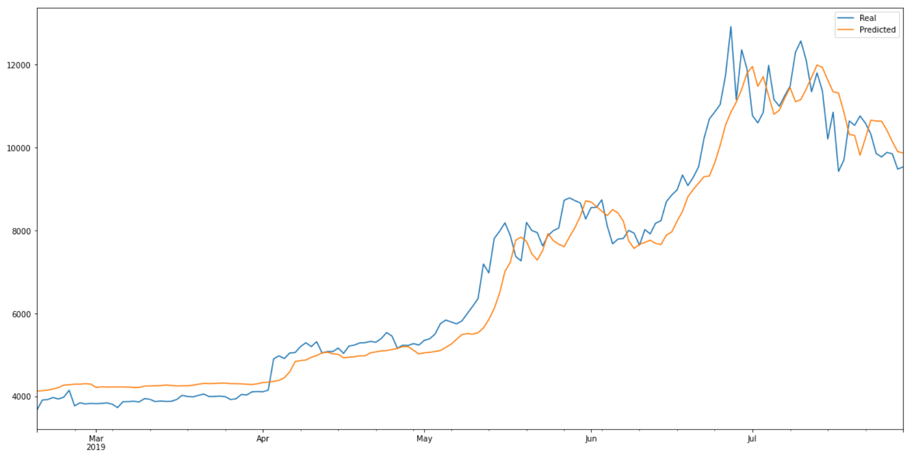

# LSTM Stock Predictor

In this assignment, I used deep learning recurrent neural networks to model bitcoin closing prices. One model used the FNG (Fear and Greed) indicators to predict the closing price, while the second model used a window of closing prices to predict the nth closing price.

I will then compare the 2 models and answer the following questions:

* Which model has a lower loss?

* Which model tracks the actual values better over time?

* Which window size works best for the model?

## Model 1 - Using FNG indicator.
[FNG Notebook](Starter_Code/lstm_stock_predictor_fng.ipynb)
* optimal window_size = 1
* loss: 0.1165

Plot of FNG model vs actual:

## Model 2 - Using closing prices.
[Closing Prices Notebook](Starter_Code/lstm_stock_predictor_closing.ipynb)
* optimal window_size = 4
* loss: 0.0055

## Answers to questions:
* Which model has a lower loss?
    * Most certainly the 'Closing Price' model has a lower loss.
* Which model tracks the actual values better over time?
    * Also, the 'Closing Price' model tracks the values better over time.
* Which window size works best for the model?
    * For the FNG model, the best window size was 1.
    * For the Closing Price model, the best window size was 4.
